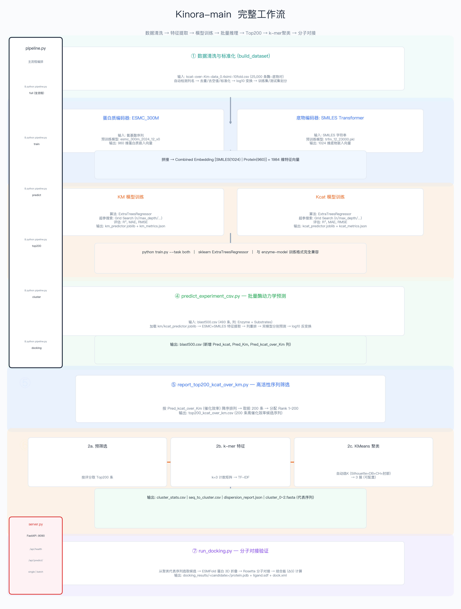

# MEnzy-KP

MEnzy-KP is a deep-learning platform for enzyme kinetics prediction and analysis. It predicts **Km** and **kcat** jointly using multitask neural networks, supports cross-validation training, batch inference, candidate screening with clustering-based analysis, and molecular docking — all wrapped with a React frontend and FastAPI backend.



## What This Repository Provides

- **Multitask model** for joint `Km` + `kcat` prediction.
- **Feature extraction pipeline** combining:
  - Protein embeddings (ESM/ESMC family),
  - Substrate embeddings (SMILES Transformer).
- **Enzyme-model module** — modular training framework with multiple architectures:
  - Baseline (protein + substrate features)
  - Condition-aware (pH, temperature, etc.)
  - MSA1D / MSA2D (evolutionary contact maps)
  - Stacking ensemble (v1 / v2)
- **Training workflow** with fold-based cross-validation and metrics export.
- **Post-inference pipeline**: batch prediction → top-N ranking → clustering → UMAP visualization → molecular docking.
- **Web application**: React + TypeScript frontend with FastAPI backend (`frontend/` + `server.py` + `api_*`).

## Repository Structure

| Path | Description |
|------|-------------|
| `main.py` | CLI command router (`build-dataset` / `train` / `predict`) |
| `config.py` | Global paths and model file locations |
| `train.py` | Multitask training entry script |
| `train_dl_monitor.py` | Training with loss logging and monitoring |
| `predict.py` | Single-sample inference |
| `predict_experiment_csv.py` | Batch prediction for CSV files |
| `pipeline.py` | End-to-end pipeline (train → predict → top200 → cluster → dock) |
| `pipeline_sixdata.py` | Pipeline variant for six-data processing |
| `server.py` | FastAPI server entry point |
| `src/` | Core library |
| `src/features/extractor.py` | SMILES / protein embedding extraction |
| `src/data/` | Dataset loading, normalization, cleaning |
| `src/trainer.py` | Training and evaluation utilities |
| `src/models/multitask_model.py` | Multitask model definition |
| `src/clustering/` | K-mer clustering and sampling |
| `src/visualization/paper_figures.py` | Paper-quality figure generation |
| `src/docking.py` | Docking utilities |
| `src/losses.py` | Custom loss functions |
| `enzyme-model/` | Modular enzyme kinetics ML framework |
| `enzyme-model/core/` | Encoders (ESM, SMILES) and feature extractors |
| `enzyme-model/models/` | Model variants (baseline, condition, msa1d, msa2d, stacking) |
| `enzyme-model/train/` | Per-model training scripts |
| `enzyme-model/evaluate/` | Evaluation, benchmarking, ablation |
| `enzyme-model/configs/` | YAML configs per model type |
| `frontend/` | React + TypeScript + Vite web frontend |
| `api_routes/` | FastAPI route handlers |
| `api_services/` | Model loading and prediction services |
| `rosetta_py/` | Rosetta molecular modeling utilities |
| `scripts/` | Clustering figures, paper workflow, cross-validation scripts |
| `figures/` | Generated figures and training history |
| `generate_*.py` | Figure generation scripts (weblogo, UMAP, HPLC, ranked-line) |
| `run_*.py` | Experiment runner scripts (clustering, docking, cross-validation, etc.) |

## Pretrained Weights Setup

Before training or inference, download the required pretrained weights:

### 1) SMILES Transformer

- Source: [DSPsleeporg/smiles-transformer](https://github.com/DSPsleeporg/smiles-transformer)
- Place under: `SMILES_Transform/`
- Required file: `trfm_12_23000.pkl`

### 2) Protein ESM weights

- Source: [evolutionaryscale/esm](https://github.com/evolutionaryscale/esm)
- Place under: `data/weights/`
- Required file: `esmc_300m_2024_12_v0.pth`

## Data and Path Conventions

- Default training dataset: `data/kcat-over-Km-data_0.4simi-10fold.csv`
- Main output directory: `models/`
- Key output artifacts:
  - `models/multitask_dl.pt`
  - `models/feature_scaler.joblib`
  - `models/target_scaler.joblib`
  - `models/metrics.json`

## Quick Start

### Training

```bash
python train.py \
  --dataset data/kcat-over-Km-data_0.4simi-10fold.csv \
  --epochs 500 \
  --test-every 5 \
  --test-patience 12 \
  --lr-patience 2 \
  --lr 5e-4 \
  --hidden-dim 192 \
  --dropout 0.45 \
  --weight-decay 0.03 \
  --train-noise-std 0.01
```

### Inference & Candidate Screening

```bash
# 1) Batch prediction on candidate CSV
python predict_experiment_csv.py --input blast500.csv

# 2) Export top-200 by kcat/Km
python report_top200_kcat_over_km.py --input blast500.csv

# 3) Full end-to-end pipeline (train → predict → cluster → dock)
python pipeline.py
```

### Web Application

```bash
# Install frontend dependencies
cd frontend && npm install && cd ..

# Start API server
python server.py

# Start frontend dev server (in another terminal)
cd frontend && npm run dev
```

### Cross-Validation

```bash
python run_cross_validation.py
```

## Models (enzyme-model)

The `enzyme-model/` module provides a modular training/evaluation framework:

| Model | Description |
|-------|-------------|
| `baseline` | Protein + substrate concatenated features |
| `condition` | Adds pH / temperature conditions |
| `msa1d` | 1D MSA-derived evolutionary features |
| `msa2d` | 2D contact map features from MSA |
| `msa2d_full` | Full 2D contact map pipeline |
| `stacking` / `stacking_v2` | Ensemble models combining multiple feature types |

Each model has its own YAML config, training script, and evaluation script under `enzyme-model/`.

## Notes

- Download and place both pretrained model files before running training or inference.
- All default paths are defined in `config.py` and can be adjusted there.
- Large data files, model artifacts, and manuscript documents are excluded via `.gitignore`.
