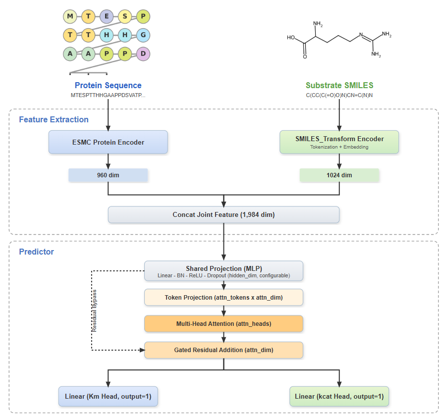

# Kinora

Kinora is a multitask deep-learning repository for enzyme kinetics modeling.  
It predicts `Km` and `kcat` jointly, supports cross-validation training, single/batch inference, top-candidate screening, and clustering-based analysis for high-activity sequences.

## Model Architecture



## What This Repository Provides

- Unified multitask model for `Km` + `kcat` prediction.
- Feature extraction pipeline combining:
  - protein embeddings (ESM/ESMC family),
  - substrate embeddings (SMILES Transformer).
- Training workflow with fold-based evaluation and metrics export.
- Practical post-inference pipeline:
  - batch prediction on candidate CSV,
  - top-200 ranking by `kcat/Km`,
  - clustering + UMAP visualization + cluster metrics.

## Repository Structure (Core Files)

- `config.py`: global paths and model file locations.
- `train.py`: multitask training entry script.
- `predict.py`: single-sample inference script.
- `predict_experiment_csv.py`: batch prediction for CSV files.
- `report_top200_kcat_over_km.py`: export top-200 rows by `Pred_kcat_over_Km`.
- `cluster_high_activity_sequences.py`: clustering and UMAP analysis for top candidates.
- `main.py`: lightweight command router (`build-dataset` / `train` / `predict`).
- `src/`:
  - `src/features/extractor.py`: SMILES/protein embedding extraction.
  - `src/data/build_dataset.py`: dataset normalization/cleaning.
  - `src/trainer.py`: training/evaluation utility functions.
  - `src/models/`: model definitions.
  - `src/visualization/paper_figures.py`: training-result figure generation.
- `figures/`: architecture and generated figures.

## Pretrained Weights Setup

Before training or inference, download required pretrained weights and place them in the exact target paths.

### 1) SMILES Transformer

- Source: [DSPsleeporg/smiles-transformer](https://github.com/DSPsleeporg/smiles-transformer)
- Place under: `Kinora/SMILES_Transform/`
- Required file: `trfm_12_23000.pkl`
- Final path: `Kinora/SMILES_Transform/trfm_12_23000.pkl`

### 2) Protein ESM weights

- Source: [evolutionaryscale/esm](https://github.com/evolutionaryscale/esm)
- Place under: `Kinora/data/weights/`
- Required file: `esmc_300m_2024_12_v0.pth`
- Final path: `Kinora/data/weights/esmc_300m_2024_12_v0.pth`

## Data and Path Conventions

- Default training dataset path: `data/kcat-over-Km-data_0.4simi-10fold.csv`
- Main output directory: `models/`
- Important output artifacts:
  - `models/multitask_dl.pt`
  - `models/feature_scaler.joblib`
  - `models/target_scaler.joblib`
  - `models/metrics.json`

## Training

Use your current training command:

```bash
python train.py --dataset data/kcat-over-Km-data_0.4simi-10fold.csv --epochs 500 --test-every 5 --test-patience 12 --lr-patience 2 --lr 5e-4 --hidden-dim 192 --dropout 0.45 --weight-decay 0.03 --train-noise-std 0.01
```

## Inference and Candidate Screening Workflow

### 1) Batch prediction on candidate CSV

```bash
python predict_experiment_csv.py --input blast500.csv
```

This appends prediction columns such as:
- `Pred_kcat`
- `Pred_Km`
- `Pred_kcat_over_Km`
- `Pred_Km_over_kcat`

### 2) Export top-200 candidates

```bash
python report_top200_kcat_over_km.py --input blast500.csv
```

Output:
- `top200_kcat_over_km.csv`

### 3) Cluster high-activity candidates

```bash
python cluster_high_activity_sequences.py --input top200_kcat_over_km.csv
```

Outputs:
- `clustered_top200_kcat_over_km.csv`
- `clustering_metrics_top200.csv`
- `protein_cluster_umap_top200_600dpi.png`

## Notes

- Download and place both pretrained model files before running any training/inference script.
- All default paths are defined in `config.py` and can be adjusted there.
